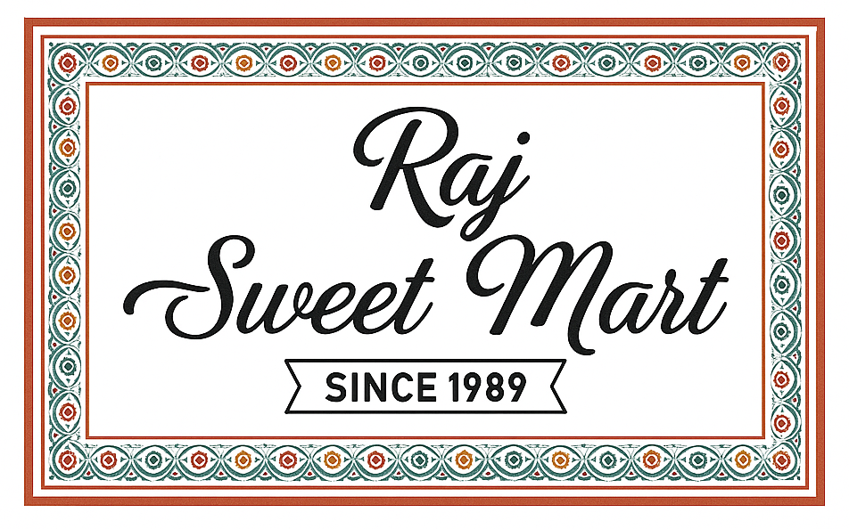

# Raj Sweet Mart 🍬

A modern, responsive web application for **Raj Sweet Mart**, a premium sweet shop located in Badnera, Amravati. This platform allows customers to explore a wide variety of traditional Indian sweets, namkeen, and snacks, place orders, and track them in real-time.



## 🌟 Key Features

- **Dynamic Menu**: Explore categorized products including Sweets, Namkeen, and Snacks with up-to-date pricing.
- **Seasonal Specials**: Dedicated sections for festive specials like Diwali.
- **Real-time Ordering**: Powered by Firebase, orders are synced instantly between customers and the admin panel.
- **User Dashboard**: Customers can view their order history and current order status.
- **Admin Panel**: A secure interface for shop owners to manage, track, and process incoming orders.
- **Light/Dark Mode**: Fully customizable theme support for a better viewing experience.
- **WhatsApp Integration**: Quick-access button for direct customer support via WhatsApp.
- **Responsive Design**: Optimized for all devices, from mobile phones to desktops.

## 🛠️ Tech Stack

- **Frontend**: HTML5, CSS3, JavaScript (Vanilla)
- **Backend/Database**: [Firebase Realtime Database](https://firebase.google.com/products/realtime-database)
- **Icons**: [Font Awesome](https://fontawesome.com/)
- **Analytics**: Google Analytics (GTAG)

## 🚀 Getting Started

### Prerequisites

| Tool | Version | Description | Check Installation |
| :--- | :--- | :--- | :--- |
| **Web Browser** | Latest | Chrome, Firefox, Edge, or Safari | `N/A` |
| **Local Server** | Any | VS Code Live Server / http-server | `N/A` |
| **Firebase** | v9+ | Realtime Database for orders | `N/A` |

### Languages & Technologies

| Language | Version | Description |
| :--- | :--- | :--- |
| **HTML** | 5 | Structural markup for all pages |
| **CSS** | 3 | Modern styling with Dark/Light mode |
| **JavaScript** | ES6+ | Client-side logic & Firebase SDK |

### Installation & Setup

1. **Clone the Repository**
   ```bash
   git clone https://github.com/your-username/raj-sweet-mart.git
   cd raj-sweet-mart
   ```

2. **Firebase Configuration**
   - This project uses Firebase for real-time data.
   - Follow the detailed [Firebase Setup Guide](FIREBASE_SETUP.md) to create your project and get your configuration keys.
   - Update your keys in `js/firebase-config.js`.

3. **Run the Project**
   - Open `index.html` using a local server (e.g., Live Server extension in VS Code).

## 📂 Project Structure

- `index.html`: Home page with shop details and opening hours.
- `menu.html`: Complete product catalog with category filtering.
- `diwali.html`: Seasonal special offerings.
- `order.html`: Cart and checkout system.
- `admin.html`: Admin dashboard for order management.
- `user-dashboard.html`: Customer order history and status.
- `js/`: Core logic, cart management, and Firebase integration.
- `css/`: Modular stylesheets for themes and layouts.
- `images/`: Product images and brand assets.

## 📍 Contact & Location

- **Address**: Bari Pura Old Town, Badnera, Amravati
- **Opening Hours**: 7:00 AM - 10:00 PM
- **WhatsApp**: [+91 9850937027](https://wa.me/+919850937027)

## 📄 License

This project is for demonstration purposes. All rights reserved by Raj Sweet Mart.
